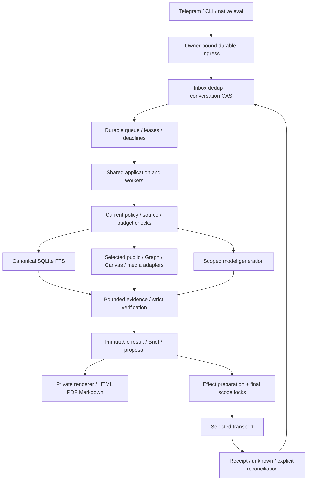
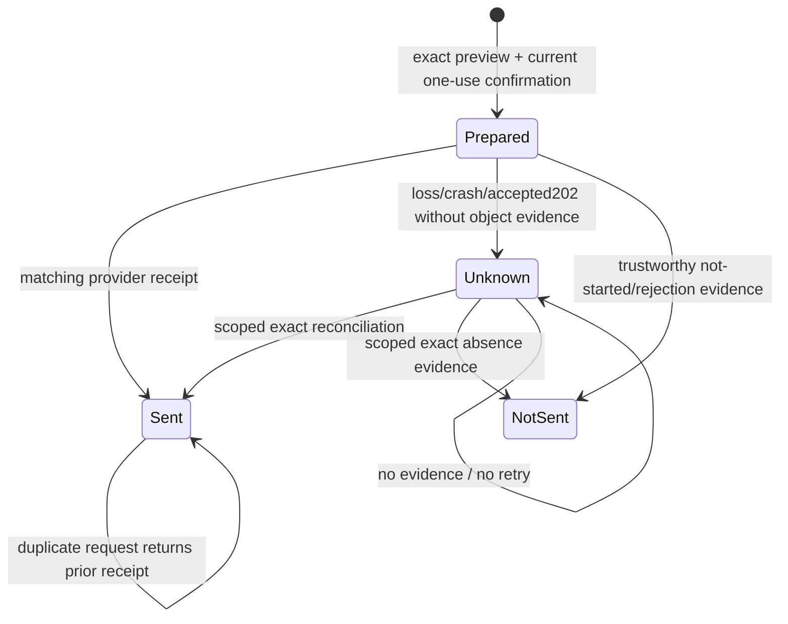

# Architecture

Version:3.0. Observed implementation snapshot:10 October2026, runtime/test/engineering SHA `0fbcfd1dde780724ad934aa66825afe17a6efc98`. Current stage and non-evidence are in [PRODUCT_STATUS](PRODUCT_STATUS.md). ADR-013 remains proposed as a human design decision; its durable local implementation now exists and must not be described as merely a plan.

## Product and entrypoints

One private owner, one assistant, five primary outcomes: Chat/Search/Brief/Watch/confirmed Act. Domain memory/media/academic sources share the same ownership/permission/result boundaries. PostgreSQL state does not replace the canonical SQLite Telegram archive. No second bot or unrestricted autonomous runtime is introduced.

`AssistantRuntime` in `src/prm/runtime/composition.py` composes the application, durable repositories, ingress, worker handlers and selected adapters. Telegram/CLI use explicit configuration; the durable path is opt-in and the current target is synthetic. Old application/callback surfaces remain compatibility callers, not proof that the deployed bot already uses the new composition.

The diagram describes code paths. Actual provider observations are Go model inference/public fetch; other transports are fixture-tested. No source/account/service becomes authorized by appearing in this graph.

## Data authorities

| Authority | Owner /purpose | What it stores | Limit |
| --- | --- | --- | --- |
| SQLite archive | Canonical private Telegram source | raw_posts/posts/FTS and source IDs | No blanket LLM egress/backfill or new canonical duplicate. |
| PostgreSQL versioned objects | Owner-bound runtime state | conversation/result/memory versions and heads | CAS, schema/digest checks, immutable result refs. |
| Policy/budget | Explicit current capability/provider/purpose | grants/revisions/revoke, reservations/windows/settlements | Source read, model egress, write, background separate; unknown spend conservative. |
| Queue/schedules | Durable operational intent | inbox/job/checkpoint/lease, occurrences/next_due | Fencing, bounded retries, cancel/quiet/caps, no catch-up burst. |
| Action/delivery ledgers | Exact effect identity | preview/confirmation/attempt/receipt/unknown | Expiry/one-use/no-replay; recipient delivery not inferred. |
| Source connections | Selected connection/resource | OAuth/vault refs, sync cursors/tombstones | Tokens outside result/job/logs; resource scope checked at use. |
| Private artifact storage | Exact report/object/version/owner | HTML/PDF/MD and metadata | Session/expiry/owner checks, no arbitrary renderer network/credentials. |

Implementation namespaces/repositories are in `src/prm/storage/` and installed runtime schemas. Job payloads refer to objects/versions/digests/consent/deadline; they are not arbitrary callables, secret containers or approval objects.

## Storage target boundary

`SyntheticTarget` accepts identified disposable PostgreSQL on127.0.0.1, non5432 port, pa_test database/role names and pa-synthetic marker. It rejects ambient PG configuration, unrecognized schema/target or privileged role. `PostgresSandbox` is a test process, not a service mutation.

Private/production target selection/authentication/migration are not implemented by removing this guard. PAI-27/28 must choose/review the real target and host before private data or cutover. Local persistence/restart tests do not imply installed production durability or backup SLO.

## Message lifecycle

1. Authenticate the owner tuple and preserve canonical update identity.
2. Store/deduplicate inbox and enqueue atomically before acknowledgement.
3. Claim bounded job/lease, use CAS state/version and actual source pointers.
4. Authorize current resource/provider/purpose/data class and reserve budget.
5. Execute a selected read/model operation under guards; classify unavailable/partial/unknown without inventing progress.
6. Verify claims against evidence, commit immutable result and source lineage.
7. Prepare delivery/effect separately; recheck owner/source/version/revoke immediately before transport.
8. Persist actual provider receipt or unknown. Reconciliation reads exact scoped evidence; it never blindly sends again.

Private connector content is not ordinary generated chat history. Original-user, generated-history and connector/archive egress have distinct gates. Topic reset/expiry affects context; it does not grant access or silently change durable preferences.

## Search and Brief

`runtime/archive.py` and `runtime/research.py` use the canonical FTS baseline. Deep research has bounded plan/steps/deadline/checkpoints, selected sources, verified synthesis and explicit fallback. `research_answer.py` accepts structured findings only when exact quote/URL and existing claim-ledger checks pass; there is no weakened global verifier.

Brief source collection/selection/editorial yields one versioned `BriefDocument`. Refresh/comparison/followups keep exact refs and identity. HTML/PDF/MD are projections of that saved document. Cover metrics now share one factual definition; full source headings survive PDF. Fixed pagination has actual layout validation and flow fallback when content cannot fit. Mobile chart values use readable textual alternatives; renderers do not load arbitrary external content.

## Effects, delivery and recovery

The diagram is a simplified effect state, not a claim of provider exactly-once. Job state and effect state differ; crash after prepared can mean external acceptance. Revocation/cancel stops unstarted work and does not erase unknown effects.

Current multipart delivery uses `_multipart_payloads` for both dispatch/reconcile: same HTML split, prefix, part count, last-part-only controls and digest. Earlier parts retain their actual receipts. Missing/not-sent later parts preserve partial aggregate unknown. The repaired P1 is independently closed by117; extreme tag-depth P2 remains documented.

Deletion inherits source/input/response/main-result lineage for diagnostic chunks and synthesis snapshots. Shared lineage locks plus parent/tombstone checks avoid inserting derived objects after deletion. Actual116 explicitly closed the original orphan-chunk P1; provider-side/backup private deletion exceptions are not live-proven.

## Adapters and model transport

- Graph: connection lifecycle/OAuth/PKCE/vault, mail/calendar read and exact action/reconcile; tested via controlled HTTP, no current real account.
- Public web/GitHub: Brave discovery requires selected key; safe primary fetch and exact repository reads have real observations.
- Canvas/academic: separately scoped minimal records, conflict/lifecycle semantics; UTD/API deferred.
- Media: bounded download/inspect/text extraction, optional speech/OCR/vision; real user provider canary missing.
- Go: actual development capture uses an explicit controlled adapter translating token parameters/declaring thinking mode; it is not a deployed production profile. Current generator V4.1 Flash, advisory reviewer/judge Pro, image judge Kimi.

Governed GLM Role Runner/phase receipts remain a distinct protocol and stale/human-gated where applicable. `opencode_pool_review.py` is advisory only. No model process writes code/grants/human approval.

## Operations and merge boundary

CLI/runtime supports local status/drain/kill, selected-domain export/import, backup/restore/rehearsal with exact manifests and monotone consumed/unknown fences. Service templates are inactive examples; installed host/process/timer state is not observed by these source tests.

This publication merges code/docs into master and may trigger CI. It does not perform production migration/deploy or enable accounts. Historical report/UTD runtime receipts retain dates and cannot serve as evidence of current deployment. Full current layer/requirement maps and next gates are in [PRODUCT_STATUS](PRODUCT_STATUS.md), [69/10 matrix](verification/PAI-requirement-evidence-20261010.md) and [pilot packet](verification/PAI-pilot-access-20261010.md).
